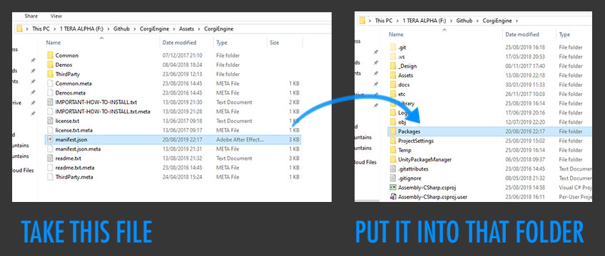

# 如何安装Corgi Engine?

> 这页解释了如何安装Corgi Engine，以及在一个新项目中的依赖。

## 介绍

无论你使用什么版本的Unity，你要记住你总应该在一个新的项目中引入这个资源包以至于让这个包能够正确的引入。如果你不打算在空的项目中引入，那么至少你要移除旧版本的Corgi Engine以避免冲突。

##  引入资源（2019.2.9f1前）

跟随这些步骤来引入资源：

​	1.从Unity Hub中创建一个新项目，选择一个新的稳定版本的Unity作为你的Unity版本，而且2D或者3D作为模板。

​	2.去资源商店（Asset Store）窗口中引入这个资源，（理应是一个空的项目，而不是已有的项目。）

​	3.在Corgi Engine将重写你当前项目设置时（这个现象很正常），你会被警告，这时你只需要点击“import“。

​	4.会花费一些时间。

​	5.一旦完成，你将得到“This Unity Package has Package Manager **dependencies**.”的提示。（这仍然很正常），点击“Install/Upgrade”。

​	6.在这之后，你将得到这个引擎内容的列表，不要去改动任何文件，点击右下角的“**Import**按钮”。

​	7.引入过程也将花费一些时间，一旦引入完成，你将可以开始享受使用这个引擎。

## 老版本的引擎

在安装之后你可能会受到很多的错误，这完全是正常的，你要做的是修复他们。

从你的文件管理器中（而非Unity中）**拷贝**位于Corgi Engine根目录的**manifest.json**文件，并粘贴到你的项目文件目录中以代替已经存在的哪一个。你可能需要重启你的Unity，或者重亲引入你的包目录，但是大多数情况下是开箱即用的。

尽管替换掉manifest是最简单也是最快的让资源生效的方法，但如果你想要更精致的掌控你项目中使用的包，譬如LWRP或HDRP，这种方法也可能导致一些问题。在这种情况下，我们推荐手动安装所有的资源依赖。让这个资源能够工作只需要三个包：Cinemachine，2D Pixel Perfect 和 PostProcessing stack。

如果你倾向于手动安装，不要复写manifest.json。打开它，在其中表明了三个依赖包的明确的版本号。然后去Window > Package Manager，安装manifest文件中对应版本的Cinemachine，2D Pixel Perfect 和 PostProcessing stack。其中一些可能与Unity的全新版本不兼容，这种情况下你应选择一个最接近的版本，或等待Corgi Engine的更新。

关于为什么会发生这种情况：目前，Unity允许Asset Store中的资源上传自己的项目配置目录（其中包含了输入、质量等），而不是上传描述了这个资源使用了什么包的manifest.json文件（例如，这个案例中的PostProcessing和Cinemachine）。希望在不久之后会有所改变。同时，如果你遇到问题，也请尝试上述的步骤。

## 目前引擎还不支持的Unity版本

Corigi Engine的更新通常都会支持Unity最新稳定版本，但是有时候也会有些迟。如果你正在全新发布的Unity中引入资源，有些包可能会不兼容，你必须按照上面的方法手动地引入依赖。

[本页面的 Corgi Engine 官方英文原版链接](https://corgi-engine-docs.moremountains.com/how-to-install.html)

# How to install the Corgi Engine?

>**Summary:** This page explains how to install the Corgi Engine and its dependencies in a new project.

 ## Introduction

Whatever version of Unity you’re using, remember to always import the asset in an **empty project**, so that the engine’s project settings get properly imported. If you decide not to import in a blank project, at least make sure to **remove the old Corgi Engine folder** first to avoid conflicts.

## Importing the asset (since 2019.2.9f1)

To import the asset, follow these steps :

1. Create a **new project** from Unity Hub, pick the latest **stable** version of Unity as your Unity version, and 2D or 3D as the Template
2. Go to the Asset Store window and **import** the project (it has to be in an empty project, not an existing one)
3. You will be warned that importing the Corgi Engine will overwrite your current project settings (that’s normal), click on Import.
4. This will take a bit of time.
5. Once this is complete, you’ll get a prompt saying “This Unity Package has Package Manager **dependencies**”. This is also normal, click on “Install/Upgrade”.
6. After that you’ll get a list of the contents of the engine, don’t touch anything, and click on **Import** in the bottom right corner.
7. Import will also take a while. Once import is complete, you’re ready to use the engine. Have fun!

## Older versions of the engine

On install you’ll likely get a number of errors, that’s absolutely normal. All you need to do to fix them is, from your file explorer (not from Unity) **copy the manifest.json** file, located at the root of the Corgi Engine folder, and **paste it into your project’s Packages folder**, replacing the one that is already there. You may have to restart Unity and/or reimport your packages folder, but most of the time it just works out of the box.

While replacing the manifest is the easiest and fastest way to go about getting the asset to work, this may cause some issues if you want finer control over what packages your project uses, such as LWRP or HDRP. In that case, it’s recommended to install all the asset’s dependencies manually. There are only 3 packages needed for the asset to work : Cinemachine, 2D Pixel Perfect, and the PostProcessing stack.

If you prefer manually installing packages, don’t override the manifest.json, but instead open it. It contains the exact version numbers you need to install for these 3 dependencies. Then go to Window > Package Manager, and install the exact same versions of Cinemachine, 2D Pixel Perfect and PostProcessing as specified in the manifest. Some of these may not be compatible with a brand new release of Unity, in which case you should probably either pick a more recent version of the package, or safely wait until the next Corgi Engine update.

A bit of info about why this may happen : Unity allows (for now) an asset on the Asset Store to upload its Project Settings folder (which includes input, quality, etc), but not the Packages’ manifest.json, which describes what packages the asset uses (such as, in this case, PostProcessing and Cincemachine). Hopefully that will change in the near future. In the meantime, please try the steps above if you run into issues.

## Unity versions not yet supported by the engine

Updates for the Corgi Engine usually support the **latest stable version of Unity**, but sometimes they lag behind a bit. If you’re importing the asset in a freshly released Unity version, chances are some packages won’t be compatible and you’ll have to manually sort dependencies using the method described above.

